# 🚀 AI-Powered Email Router

[](https://github.com/colenielsonauto/email_router/actions/workflows/test.yml)
[](https://github.com/colenielsonauto/email_router/actions/workflows/deploy.yml)
[](https://github.com/colenielsonauto/email_router)
[](https://www.python.org/downloads/)

> **Smart email processing and routing system powered by Google AI and deployed on Google Cloud Functions.**

Transform your email workflow with AI-powered classification, intelligent routing, and automated draft responses. Built for production with enterprise-grade reliability.

## ✨ Features

### 🤖 **AI-Powered Intelligence**
- **Smart Classification**: Automatically categorizes emails (Support, Sales, Billing, etc.)
- **Context-Aware Drafts**: Generates intelligent reply drafts using Google Gemini AI
- **Detail Extraction**: Identifies key information like deadlines, attachments, and urgency

### 📧 **Gmail Integration**
- **Real-Time Processing**: Instant email processing via Gmail Pub/Sub notifications
- **OAuth2 Security**: Secure authentication with Google APIs
- **History API**: Efficient email fetching and processing

### 🎯 **Smart Routing**
- **Team-Based Forwarding**: Routes emails to appropriate teams automatically
- **SLA Management**: Configurable response time commitments
- **Flexible Rules**: Easy-to-modify routing configuration

### 🏗️ **Production Ready**
- **Cloud Functions**: Serverless deployment on Google Cloud
- **Error Handling**: Graceful fallbacks and comprehensive logging
- **Testing Suite**: Full integration and unit test coverage
- **CI/CD Pipeline**: Automated testing and deployment

## 🎬 **How It Works**

```mermaid
graph LR
    A[📧 Incoming Email] --> B[Gmail Watch API]
    B --> C[Pub/Sub Notification]
    C --> D[🤖 Cloud Function]
    D --> E[AI Classification]
    E --> F[Team Routing]
    F --> G[📤 Forward + Draft]
    G --> H[✅ Complete]
```



1. **Email Arrives** → Gmail sends Pub/Sub notification
2. **AI Analysis** → Gemini classifies and extracts details  
3. **Smart Routing** → Forwards to appropriate team with SLA
4. **Draft Generation** → Creates contextual reply draft

## 🚀 **Quick Start**

### Prerequisites
- Python 3.11+
- Google Cloud Project
- Gmail API credentials
- Google AI API key

### 1. Clone & Setup
```bash
git clone https://github.com/colenielsonauto/email_router.git
cd email_router
python -m venv .venv
source .venv/bin/activate  # On Windows: .venv\Scripts\activate
pip install -r requirements.txt
```

### 2. Configure Environment
```bash
cp .env.example .secrets/.env
# Edit .secrets/.env with your API keys
```

### 3. Set Up Credentials
```bash
# Place your Google OAuth credentials in:
.secrets/oauth_client.json
.secrets/token.json  # Generated after first OAuth flow
```

### 4. Test Locally
```bash
# Run all tests
python -m pytest tests/ -v

# Test the full pipeline
python tests/integration/test_full_pipeline.py

# Check system health
python scripts/smoke_test.py
```

### 5. Deploy to Google Cloud
```bash
# Deploy via GitHub Actions (recommended)
git push origin main

# Or deploy manually
gcloud functions deploy email-router \
  --gen2 \
  --runtime=python311 \
  --source=functions/email_router \
  --entry-point=pubsub_webhook \
  --trigger-topic=email-inbound
```

## 📊 **Project Status**

| Component | Status | Notes |
|-----------|---------|-------|
| **Core Pipeline** | ✅ Complete | All tests passing |
| **AI Integration** | ✅ Production | Google Gemini API |
| **Gmail API** | ✅ Working | OAuth2 + History API |
| **Cloud Functions** | ✅ Ready | Local testing successful |
| **Code Quality** | ✅ Excellent | 0 linting errors |
| **Testing** | ✅ Comprehensive | 8/8 integration tests |

**Current Test Results:**
- ✅ Email Classification (Support/Sales/Billing)
- ✅ Real Gmail API Integration  
- ✅ AI Draft Generation
- ✅ Team Routing with SLA
- ✅ OAuth2 Authentication
- ✅ Error Handling & Fallbacks

## 🧪 **Testing Examples**

The system intelligently processes different email types:

**📞 Support Request:**
```
From: user@company.com
Subject: Cannot login to account
→ Classification: Support
→ Routes to: support team (4hr SLA)
→ Draft: "Thank you for contacting support..."
```

**💰 Billing Inquiry:**
```
From: finance@client.com  
Subject: Invoice #12345 question
→ Classification: Billing
→ Routes to: billing team (2hr SLA)
→ Draft: "Thank you for your billing inquiry..."
```

**💼 Sales Lead:**
```
From: prospect@enterprise.com
Subject: Enterprise plan pricing
→ Classification: Sales  
→ Routes to: sales team (1hr SLA)
→ Draft: "Thank you for your interest in our enterprise..."
```

## 🏗️ **Architecture**

```
src/email_router/
├── config/          # Configuration and environment setup
├── core/            # Core email processing pipeline
│   ├── ingest_email.py      # Gmail message parsing
│   ├── analyze_email.py     # AI classification & analysis  
│   └── forward_and_draft.py # Team routing & draft generation
├── handlers/        # Cloud Functions entry points
└── prompts/         # AI prompt templates

functions/           # Cloud Functions deployment
tests/              # Comprehensive test suite
scripts/            # Utility and testing scripts
```

## 🔧 **Configuration**

### Environment Variables
```bash
# Required
GOOGLE_API_KEY=your_gemini_api_key
GOOGLE_CLOUD_PROJECT=your-project-id
PUBSUB_TOPIC=projects/your-project/topics/email-inbound

# Optional  
LOG_LEVEL=INFO
ENVIRONMENT=production
CLOUD_FUNCTION_REGION=us-central1
```

### Team Routing Rules
Customize routing in `src/email_router/config/roles_mapping.json`:

```json
{
  "Support": {
    "email": "support@yourcompany.com",
    "response_time_sla": "4 hours"
  },
  "Sales": {
    "email": "sales@yourcompany.com", 
    "response_time_sla": "1 hour"
  },
  "Billing": {
    "email": "billing@yourcompany.com",
    "response_time_sla": "2 hours"
  }
}
```

## 🚧 **Development**

### Code Quality
- **Black** for code formatting
- **Flake8** for linting  
- **MyPy** for type checking
- **Pytest** for testing

```bash
# Format code
black src/

# Check linting
flake8 src/ --max-line-length=88

# Run type checking
mypy src/

# Run tests with coverage
python -m pytest tests/ --cov=src/
```

### Git Workflow
- `main` - Production releases
- `develop` - Integration branch
- `feature/*` - Feature development
- `hotfix/*` - Emergency fixes

## 🤝 **Contributing**

1. Fork the repository
2. Create a feature branch (`git checkout -b feature/amazing-feature`)
3. Make your changes
4. Add tests for new functionality
5. Ensure all tests pass (`python -m pytest`)
6. Commit your changes (`git commit -m 'Add amazing feature'`)
7. Push to the branch (`git push origin feature/amazing-feature`)
8. Open a Pull Request

## 📜 **License**

This project is licensed under the MIT License - see the [LICENSE](LICENSE) file for details.

## 🙏 **Acknowledgments**

- **Google Cloud Functions** for serverless hosting
- **Google Gemini AI** for intelligent email analysis
- **Gmail API** for email integration
- **Python** ecosystem for robust development tools

---

**Built with ❤️ for intelligent email automation**

[Report Bug](https://github.com/colenielsonauto/email_router/issues) · [Request Feature](https://github.com/colenielsonauto/email_router/issues) · [Documentation](https://github.com/colenielsonauto/email_router/wiki)
