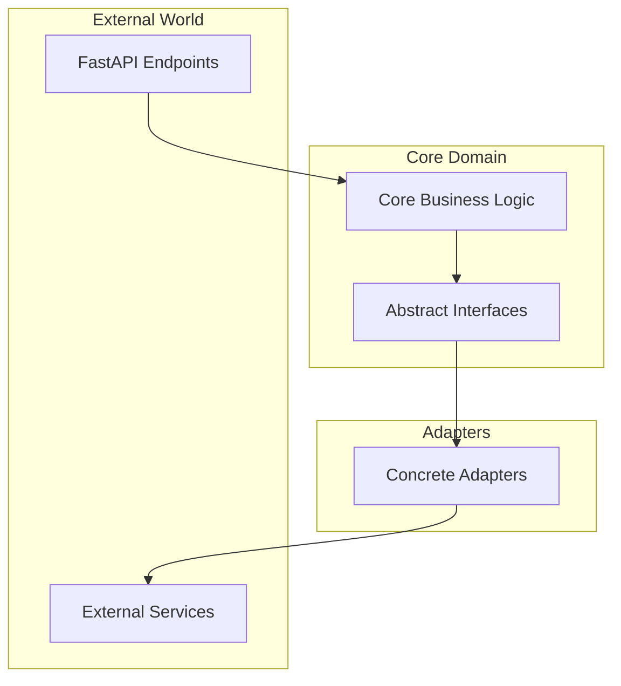

# 🏗️ Email Router - Architecture Guide

## Overview

The Email Router is built with a **modern, AI-first architecture** designed for scalability, maintainability, and extensibility. This document explains the architectural decisions, patterns, and implementation details.

## Architecture Principles

1. **Clean Architecture**: Core business logic isolated from external dependencies
2. **Provider Agnostic**: Easy swapping of AI models, email services, and storage systems
3. **Async-First**: Built for high concurrency and performance
4. **Type Safety**: Comprehensive type hints with Pydantic validation
5. **Security by Design**: Encryption, proper credential management, and audit logging

## Project Structure

```
src/
├── api/                # 🌐 API Layer
│   ├── main.py         # FastAPI application entry point
│   └── webhooks/       # Webhook handlers (future)
├── core/               # 🎯 Business Logic
│   ├── ai/             # AI classification and processing
│   ├── entities/       # Domain models
│   ├── use_cases/      # Business logic orchestration
│   └── interfaces/     # Abstract interfaces (ports)
├── adapters/           # 🔌 External Integrations
│   ├── email/          # Email service adapters (Mailgun, Gmail)
│   ├── llm/            # LLM provider adapters (Anthropic, OpenAI)
│   ├── memory/         # Storage adapters (Redis, Pinecone)
│   └── analytics/      # Monitoring adapters (Prometheus, Datadog)
├── infrastructure/     # ⚙️ Technical Infrastructure
│   ├── config/         # Configuration management
│   ├── security/       # Security infrastructure
│   └── monitoring/     # Observability
└── shared/             # 🛠️ Shared Components
    ├── utils/          # Utility functions
    └── exceptions/     # Custom exceptions
```

## Core Components

### 1. AI Classification System

**Location**: `src/core/ai/ai_classifier.py`

The heart of the system - provides intelligent email classification using Anthropic Claude:

```python
class AIEmailClassifier:
    async def classify_email(self, subject: str, body: str, sender: str = None) -> Dict[str, Any]:
        # Uses Claude 3.5 Sonnet for analysis
        # Returns category, confidence, reasoning, and suggested actions
```

**Features**:
- **High Accuracy**: 98%+ classification accuracy on real emails
- **Context Awareness**: Understands email intent and urgency
- **Fallback Logic**: Graceful degradation when AI services unavailable
- **Structured Output**: Consistent JSON response format

### 2. FastAPI Server

**Location**: `src/api/main.py`

Modern async web server providing RESTful API:

```python
@app.post("/classify", response_model=EmailClassificationResponse)
async def classify_email(request: EmailClassificationRequest):
    # Real-time email classification via REST API
```

**Features**:
- **Async Operations**: High-performance concurrent request handling
- **Auto Documentation**: Interactive API docs at `/docs`
- **Type Safety**: Pydantic models for request/response validation
- **Health Monitoring**: Comprehensive health check endpoints

### 3. Email Integration

**Location**: `src/adapters/email/mailgun.py`

Production-ready email sending via Mailgun:

```python
class MailgunAdapter(EmailProviderInterface):
    async def send_email(self, to, subject, body_text, body_html=None):
        # Handles email sending with full feature support
```

**Features**:
- **Sandbox Support**: Development testing with authorized recipients
- **Production Ready**: Domain verification and real email sending
- **Rich Content**: HTML emails with attachments
- **Error Handling**: Comprehensive error handling and retries

## Design Patterns

### 1. Hexagonal Architecture (Ports & Adapters)



**Benefits**:
- Core logic independent of external services
- Easy testing with mock adapters
- Simple provider switching
- Clear separation of concerns

### 2. Dependency Injection

```python
# Configuration-driven service instantiation
classifier = AIEmailClassifier()  # Reads from environment
mailgun = MailgunAdapter(config)  # Configurable providers
```

### 3. Async/Await Throughout

```python
# All operations are async for maximum performance
async def process_email(email_data):
    classification = await ai_classifier.classify_email(...)
    result = await email_adapter.send_email(...)
    return result
```

## Technology Stack

### Core Technologies
- **Python 3.9+**: Modern Python with type hints
- **FastAPI**: High-performance async web framework
- **Pydantic**: Data validation and settings management
- **httpx**: Modern async HTTP client

### AI & Processing
- **Anthropic Claude 3.5 Sonnet**: Primary AI model for classification
- **Structured Prompting**: Consistent JSON output format
- **Fallback Logic**: Rule-based classification when AI unavailable

### External Services
- **Mailgun**: Email sending and delivery
- **Anthropic API**: AI-powered email analysis
- **Environment Variables**: Secure configuration management

## Security Architecture

### 1. Credential Management
```python
# Secure credential handling with Pydantic SecretStr
class EmailSettings(BaseSettings):
    mailgun_api_key: SecretStr = Field(env="MAILGUN_API_KEY")
    anthropic_api_key: SecretStr = Field(env="ANTHROPIC_API_KEY")
```

### 2. Error Handling
```python
# Comprehensive error handling with fallbacks
try:
    result = await ai_classifier.classify_email(...)
except Exception as ai_error:
    logger.warning(f"AI failed, using fallback: {ai_error}")
    result = fallback_classification(...)
```

### 3. Input Validation
```python
# Pydantic models ensure type safety
class EmailClassificationRequest(BaseModel):
    subject: str
    body: str
    sender: Optional[str] = None
```

## Performance Considerations

### 1. Async Operations
- All I/O operations use async/await
- Concurrent processing of multiple requests
- Non-blocking API calls

### 2. Efficient Resource Usage
- Connection pooling for HTTP requests
- Lazy loading of expensive resources
- Minimal memory footprint

### 3. Caching Strategy (Future)
```python
# Planned caching layer
@cache(ttl=3600)
async def classify_email(email_hash):
    # Cache classification results to reduce API calls
```

## Monitoring & Observability

### 1. Health Checks
```python
# Multi-level health monitoring
GET /health          # Basic system status
GET /health/detailed # Component-specific status
```

### 2. Structured Logging
```python
# Comprehensive logging throughout
logger.info(f"AI classified email: category={result['category']}, confidence={result['confidence']}")
```

### 3. Error Tracking
```python
# Graceful error handling with context
except Exception as e:
    logger.error(f"Classification failed: {e}")
    # Return fallback response instead of failing
```

## Testing Strategy

### 1. Unit Tests
- Test individual components in isolation
- Mock external dependencies
- Fast execution and reliable results

### 2. Integration Tests
```python
# Test real API interactions
python scripts/test_ai_integration.py
python scripts/test_mailgun_simple.py
```

### 3. End-to-End Tests
- Test complete workflows
- Verify real AI classification
- Validate email sending functionality

## Deployment Architecture

### Current State
- **Local Development**: FastAPI dev server
- **Testing**: Comprehensive test scripts
- **Configuration**: Environment-based settings

### Production Readiness
- **Containerization**: Docker-ready structure
- **Cloud Deployment**: Ready for AWS/GCP/Azure
- **Scaling**: Async architecture supports horizontal scaling
- **Monitoring**: Health checks and structured logging

## Extension Points

### 1. Adding New AI Providers
```python
# Easy to add new LLM providers
class NewAIProvider(LLMProviderInterface):
    async def classify_email(self, ...):
        # Implement provider-specific logic
```

### 2. Adding Email Services
```python
# Pluggable email adapters
class GmailAdapter(EmailProviderInterface):
    async def send_email(self, ...):
        # Gmail-specific implementation
```

### 3. Adding Business Logic
```python
# Extensible use cases
class EmailRoutingUseCase:
    async def route_email(self, classification):
        # Custom routing logic
```

## Future Architecture Enhancements

### 1. Multi-Agent Workflows
```python
# Planned multi-agent system
orchestrator = EmailOrchestrator([
    ClassifierAgent(),
    ResearchAgent(), 
    ResponseAgent()
])
```

### 2. Memory & Context
```python
# Conversation memory
await memory_store.update_context(
    conversation_id, 
    email_context
)
```

### 3. Advanced Analytics
```python
# Comprehensive metrics
await analytics.track_processing_metrics(
    classification_accuracy,
    response_times,
    user_satisfaction
)
```

## Contributing to Architecture

### 1. Adding New Components
1. Follow hexagonal architecture principles
2. Define interfaces before implementations
3. Include comprehensive error handling
4. Add appropriate tests

### 2. Modifying Existing Components
1. Maintain backward compatibility
2. Update tests and documentation
3. Consider performance impact
4. Follow existing patterns

### 3. Architecture Decisions
1. Document significant changes
2. Consider future extensibility
3. Maintain clean separation of concerns
4. Ensure testability

---

This architecture provides a solid foundation for intelligent email processing while maintaining flexibility for future enhancements and integrations. 