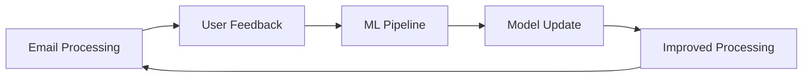

# Machine Learning & AI Components

This directory contains advanced ML/AI components for improving email processing over time.

## Overview

The ML module enables the email router to learn and improve through:
- **Prompt Engineering**: Advanced prompt optimization
- **Embeddings**: Semantic understanding and similarity
- **Fine-tuning**: Custom model training
- **Evaluation**: Performance metrics and A/B testing

## Directory Structure

### `prompts/`
Advanced prompt engineering and optimization:
- **Prompt Templates**: Versioned, testable prompts
- **Few-shot Learning**: Dynamic example selection
- **Chain-of-Thought**: Complex reasoning prompts
- **Prompt Optimization**: Automatic prompt improvement

### `embeddings/`
Vector operations and semantic search:
- **Embedding Models**: Multiple embedding providers
- **Dimensionality Reduction**: PCA, UMAP for efficiency
- **Similarity Metrics**: Cosine, Euclidean, etc.
- **Clustering**: Email pattern discovery

### `fine_tuning/`
Model customization and training:
- **Data Preparation**: Training data pipelines
- **Fine-tuning Scripts**: OpenAI, Cohere fine-tuning
- **Model Evaluation**: Performance benchmarks
- **Version Control**: Model versioning and rollback

### `evaluation/`
Performance measurement and optimization:
- **Metrics Collection**: Accuracy, F1, response quality
- **A/B Testing**: Prompt and model comparison
- **User Feedback**: Integration with user ratings
- **Continuous Learning**: Automatic improvement loops

## Planned Features

### 1. Intelligent Prompt Selection
```python
from ml.prompts import PromptSelector

selector = PromptSelector()
best_prompt = await selector.select_optimal_prompt(
    task="email_classification",
    context=email_context,
    performance_history=history
)
```

### 2. Custom Embeddings
```python
from ml.embeddings import EmbeddingService

embedder = EmbeddingService(model="email-specialized-v1")
embeddings = await embedder.embed_emails(emails)
similar_emails = await embedder.find_similar(query_email, top_k=10)
```

### 3. Model Fine-tuning
```python
from ml.fine_tuning import FineTuner

tuner = FineTuner(base_model="gpt-3.5-turbo")
fine_tuned_model = await tuner.train(
    training_data=email_classifications,
    validation_split=0.2,
    epochs=3
)
```

### 4. Performance Tracking
```python
from ml.evaluation import Evaluator

evaluator = Evaluator()
metrics = await evaluator.evaluate_classification(
    predictions=classifications,
    ground_truth=human_labels
)

# A/B test different approaches
results = await evaluator.ab_test(
    variant_a=gemini_classifier,
    variant_b=gpt4_classifier,
    test_emails=test_set
)
```

## Integration with Core System

### Feedback Loop


### Data Collection
- Classification corrections
- Response quality ratings
- Processing time metrics
- User preference changes

### Privacy Considerations
- Differential privacy for training
- On-device learning options
- Federated learning support
- Data anonymization

## Future Research Areas

1. **Multi-modal Understanding**: Processing email attachments
2. **Conversation Modeling**: Understanding email threads
3. **Intent Prediction**: Anticipating user needs
4. **Anomaly Detection**: Identifying unusual patterns
5. **Transfer Learning**: Leveraging pre-trained models

## Tools and Frameworks

### Current
- **scikit-learn**: Classical ML algorithms
- **NumPy/Pandas**: Data processing
- **Weights & Biases**: Experiment tracking

### Planned
- **Hugging Face**: Model hub integration
- **Ray**: Distributed training
- **MLflow**: Model lifecycle management
- **DVC**: Data version control

## Best Practices

1. **Versioning**: Track all prompts, models, and datasets
2. **Testing**: Comprehensive evaluation before deployment
3. **Monitoring**: Real-time performance tracking
4. **Rollback**: Quick reversion to previous versions
5. **Documentation**: Clear experiment logs and results 